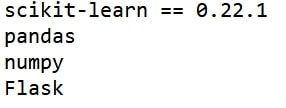
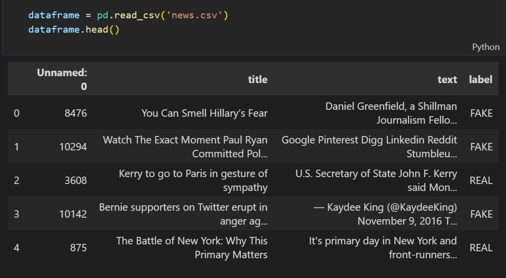
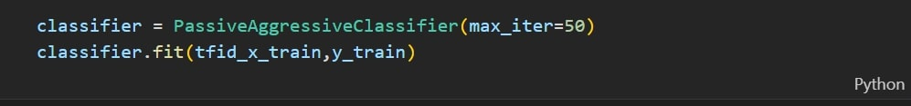
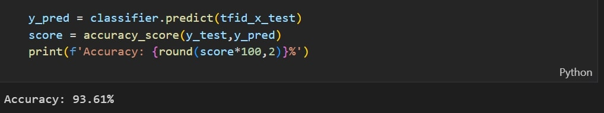
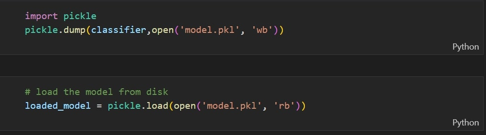
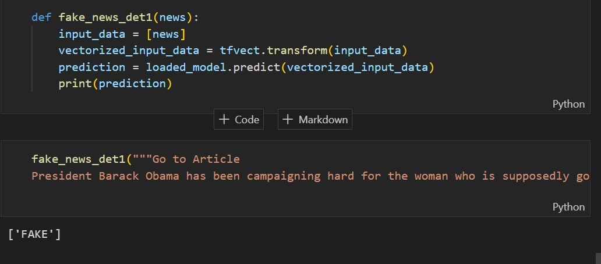
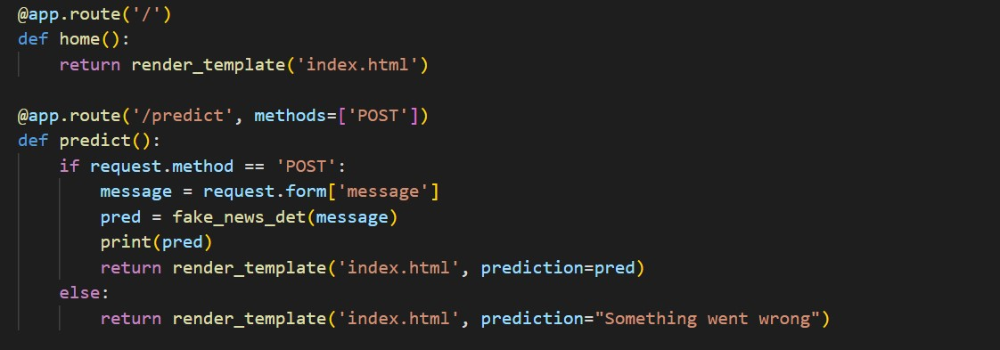
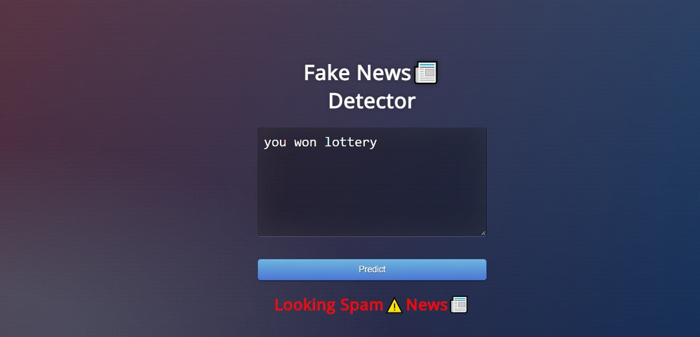

# PROJECT OVERVIEW

# D. PROJECT EXECUTION

## PROJECT DESIGN AND CODING

**PART 1: FLOWCHART OF THE PROJECT**

**PART 2: DESCRIPTION OF THE PROJECT**

Library and package require:

This project is a web based project by using Flask.Before we start to make this system, the user must make sure to install all the require library or package to prevent error.

First , we get the dataset which is news.csv .This dataset is use for train the modal.In this project , we seperate the dataset randomly to two class which is train and test.

Then , we define classifier and use the predict function to get the accuracy of the pre-trained modal.For this case, we get the accuracy achieve 93.61%.

Moreover , we save the model by using libary Pickle. Pickle is a libary that we can pass the model object into the dump() function of Pickle. In this case, we store our model as model.pkl.

On the other hand , we test the model by enter input randomly.This step must be execute to make sure pre-trained model function as we expected.

Moreover , we make it become a web based system by using Flask.Flask is a micro web framework written in Python.

Last but not least , in web based we need to make GUI by using html and css. For the app.py , we need to create a function for home and prediction.

Final step : Run app.py only to get the Ip address.

# Project Result
Result using flask

**Next:** [Project Closing](/Project-Management-Plan/E-Project-Closing.md)
